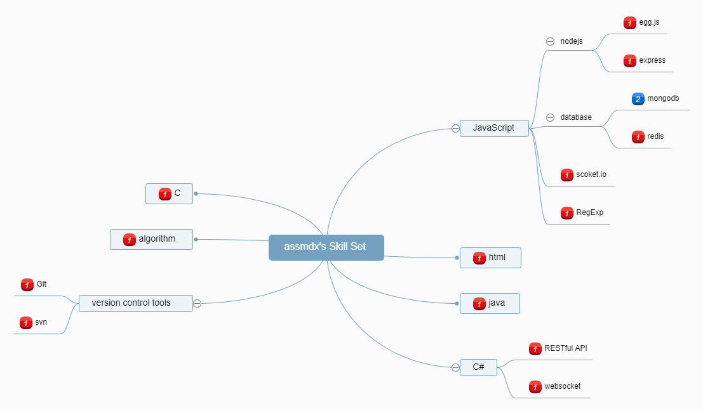

# SkillSet
A simple JSON format for skill sets and a mind map generator

[Demo](http://nexzhu.github.io/SkillSet/)

## Background

Initially created to help me choose technology stacks for 2015 Eleme Hackathon according to the skill sets of my teammates and me.

SkillSet can also be used to communicate skill sets and skill requirements between employers and job seekers, or to help leaders optimize assignment of tasks to teams.

SkillSet uses [Baidu FEX team](http://fex.baidu.com/)'s [Kity](https://github.com/fex-team/kity) and [KityMinder Core](https://github.com/fex-team/kityminder-core) to generate mind maps.

## Skill Levels

    1: Novice
    2: Intermediate
    3: Advanced
    4: Expert
    5: Master

## Example

### JSON

```json
{
  "name":"assmdx",
  "skillset": {
    "JavaScript":{
      "nodejs":{
        "egg.js":1,
        "express":1
      },
      "database":{
        "mongodb":2,
        "redis":1
      },      
      "scoket.io":1,
      "RegExp":1
    },
    "html":1,
    "java":1,
    "C#":{
      "RESTful API":1,
      "websocket":1
    },
    "C":1,
    "algorithm":1,
    "version control tools":{
      "Git":1,
      "svn":1
    }
  }
}


```

### Generated Mind Map


